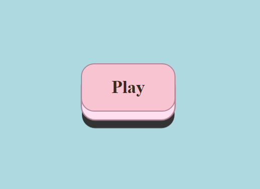

# Video Game Button

## Background
This is one of 40 challenges in Scrimba's <a href="https://v2.scrimba.com/react-challenges-c02n">React Challenges</a> 

## Challenge

```
 You're creating a button that will allow the user to play and pause a video game. Your task is to set it up and insert it in the div below (line 29) as follows: 
            
        1. The button should receive a class name of "video-game-button"
        
        2. When the user clicks the button, the gameRunning state's boolean value should be set to 
           the opposite value of what it currently is (from true to false or vice-versa).
            
        3. If gameRunning is true, the button should display the word "Pause". If gameRunning is 
           false, the button should display the word "Play". In other words:
          
             ┌─────────────┐     ------------>     ┌─────────────┐            
             │     Play    │         click         │    Pause    │
             └─────────────┘     <------------     └─────────────┘
           gameRunning = false                    gameRunning = true 
             (game is paused)                      (game is playing)
             
        4. If you complete these tasks correctly, the button should have some nice visual effects 
           when you click it, and the workshop background should be automatically replaced by a light blue background.
```

<br/>

<em>The button.</em>
<br/>
<br/>
<br/>

## Technologies
- HTML
- CSS
- React

## Live link
The solution is deployed here:
[https://video-game-button.netlify.app](https://video-game-button.netlify.app)
